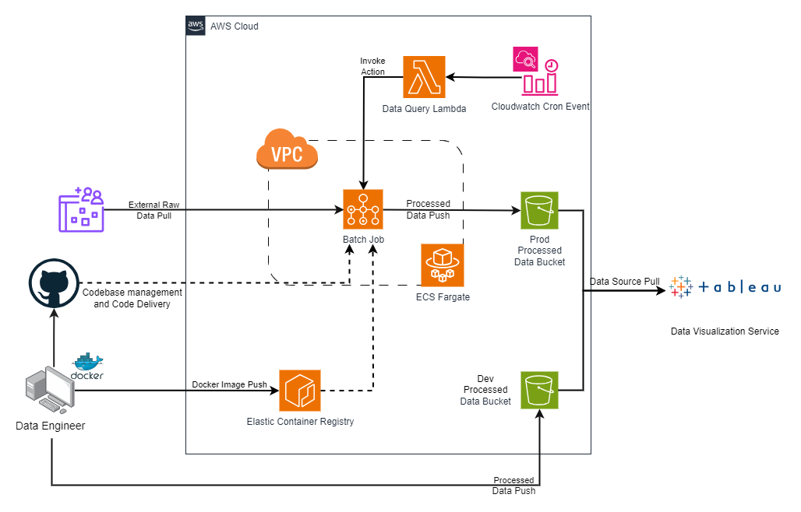
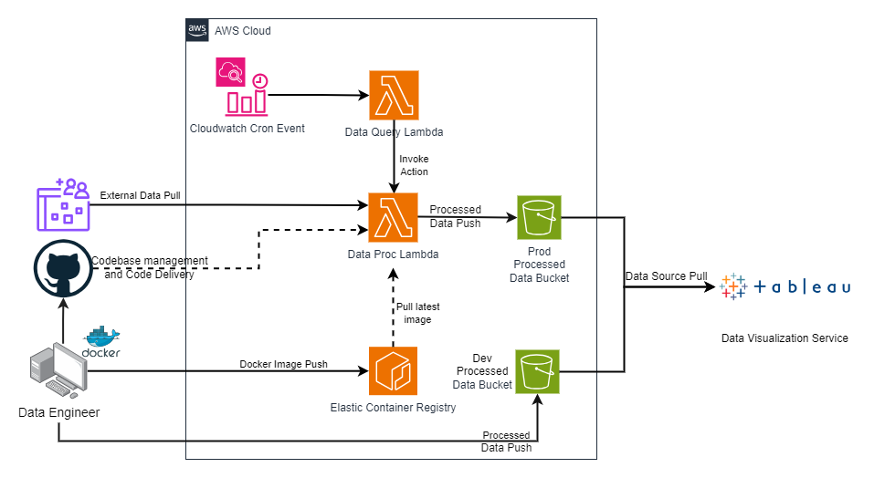
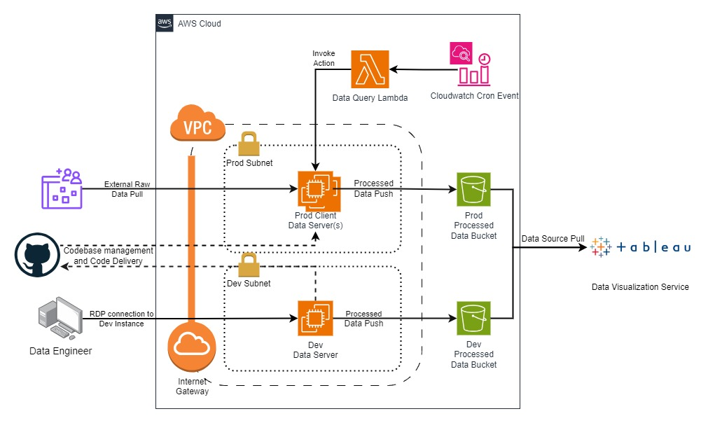

# AWS ETL Pipeline
Hey everyone! Welcome to my AWS ETL Pipeline. This repository holds three different deployment strategies for an ETL pipeline and data processing on AWS. Let dive into it.

## Prerequisites
The following items are prerequisites for this deployment.
<ul>
    <li>TBD</li>
</ul>

## Deployment use-case
These deployment strategies were developed with a particular use-case in mind: A data analytics company is looking to move their operations to the cloud. In their current workflow, they pull raw data from an external cloud portal. They must be able to process this data with their programming language of choice, R, and store this in a cloud storage solution that Tableau can query.

## Deployment Overview
Why three deployments? Clouds versatility allows for flexible solutions, it also allows for many solutions. Solving the same use-case three different ways helps me understand the complexity of each solution, from an architect and a client perspective. Further I can compare the costs of each solution and production viability. Is there a potential solution I missed? Let me know and I'll look into adding it.
### Core Deployments
#### Core Infrastructure
Certain elements of the proposed architecture remain the same across each deployment. To increase the efficiency of switching deployment strategies and segmenting the static architecture components, these have been developed within the core infrastructure module. These items include: the data query Lambda, dev and prod S3 buckets, Cloudwatch cron event, and the service principal creation for 3rd party data access.
#### ECR
The container and lambda deployments require a dedicated container image to be developed, for those deployments, the ECR module has been created to handle the container registry and storage of the dedicated R container image.
### ETL Deployment Strategies
There are two deployment strategies inside this repository. 
<ol>
    <li>Containerized Deployment</li>
    <li>Lambda Deployment</li>
    <li>VM Deployment</li>
</ol>
These deployment strategies will be broken down below. Details will be shared around their architecture diagram, corresponding Terraform modules and the steps to deploy.

## Container Deployment
<table>
    <tr>
        <th>Status</th><th>Deployment Cost</th>
    </tr>
    <tr>
        <td>Final Touches</td><td>TBD</td>
    </tr>
</table>
The architecture diagram for this diagram is displayed below:

Terraform Module:
module.container_batch_deployment

## Lambda Deployment
<table>
    <tr>
        <th>Status</th><th>Deployment Cost</th>
    </tr>
    <tr>
        <td>Final Touches</td><td>TBD</td>
    </tr>
</table>
The architecture diagram for this diagram is displayed below:

Terraform Module:
module.lambda_deployment

## VM Deployment
<table>
    <tr>
        <th>Status</th><th>Deployment Cost</th>
    </tr>
    <tr>
        <td>Final Touches</td><td>TBD</td>
    </tr>
</table>
The architecture diagram for this diagram is displayed below:

Terraform Module:
module.vm_deployment

## Scripts
The following scripts are made for ease of management: reset.sh, vmdeploy.sh, s3deploy.sh, containerdeploy.sh
These scripts will be explained below.

### reset.sh
Resets the environment by destroying content from lambdadeploy, vmdeploy, containerdeploy but leaving core infrastructure

### destroy.sh
Runs a Terraform destroy destroying all currently deployed resources

### lambdadeploy.sh
deploys 1x elastic container registry, 1x docker image, 1x lambda

### containerdeploy.sh
deploys container_batch_deployment module including the following resources: networking (1x VPC, 4x subnets, 
1x route table, 1x internet gateway), 1x elastic container registry, 1x docker image, 1x Batch job/queue
To make this script more efficient, it should be executed through a Terraform null resource so that it can place a dependency on the ECR cluster and the container can depend on the null resource. I'm leaving this to an interested party to integrate as it is not my primary solution.

### vmdeploy.sh
deploys vm_deployment module including the following resources: networking (1x VPC, 4x subnets, 
1x route table, 1x internet gateway), ?x prod EC2 instances, 1x dev EC2 launch configuration

## Licensing

Everything is licensed under the MIT license, feel free to repurpose my code for whatever you'd like.

## Contact

Reach out to me below for any questions:

Email: benwagrez@gmail.com
LinkedIn: https://www.linkedin.com/in/benwagrez/

